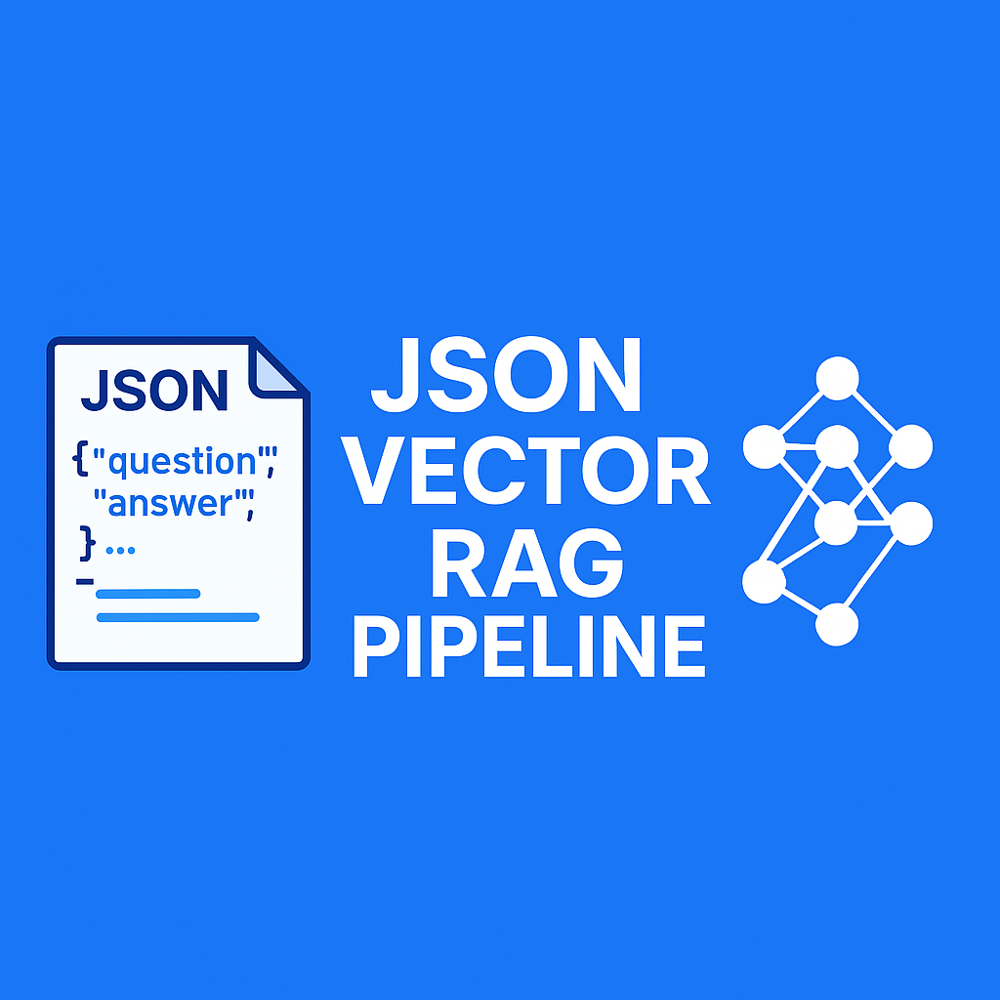

<p align="center">
  
</p>

# json-vector-rag-pipeline

A lightweight Retrieval-Augmented Generation (RAG) pipeline to parse, vectorize, and semantically search JSON data such as FAQs, Q&A, or product descriptions. Uses FAISS for vector storage and OpenAI or Hugging Face models for LLM-based responses.

Repo: [https://github.com/SAGAR-TAMANG/json-vector-rag-pipeline](https://github.com/SAGAR-TAMANG/json-vector-rag-pipeline)

<p align="center">
  

  See Tutorial on Youtube: [https://www.youtube.com/watch?v=T17G-KewCb4](https://www.youtube.com/watch?v=T17G-KewCb4)
</p>


## Features

- ✅ Load and parse JSON datasets of any structure
- 🔍 Vectorize content using Sentence Transformers
- ⚡ Store and query with FAISS for fast similarity search
- 🤖 Generate responses using OpenAI GPT (RAG-style)
- 📦 Includes working Jupyter notebook with full flow

## Installation

### 1. Clone the Repository

```bash
git clone https://github.com/SAGAR-TAMANG/json-vector-rag-pipeline.git
cd json-vector-rag-pipeline
```

### 2. Create a Virtual Environment

#### On Windows:

```bash
python -m venv venv
venv\Scripts\activate
```

#### On macOS/Linux:

```bash
python3 -m venv venv
source venv/bin/activate
```

### 3. Install Requirements

```bash
pip install -r requirements.txt
```

### 4. Add OpenAI API Key

Create a `.env` file in the project root and add your API key:

```env
OPENAI_API_KEY=your_openai_api_key
```

## Usage

Open the notebook `main.ipynb` to run the full pipeline:

1. Load and parse your JSON file (e.g., `FAQ.json`)
2. Vectorize documents using Sentence Transformers
3. Store vectors in a FAISS index
4. Perform semantic search with a user query
5. Generate a contextual response using an LLM (e.g., GPT-4)

## Project Structure

```text
json-vector-rag-pipeline/
│
├── data/                        # Stores FAISS index
├── main.ipynb                   # Main pipeline code (Jupyter notebook)
├── requirements.txt             # Python dependencies
├── .env                         # API keys (not committed)
├── README.md                    # Project documentation
└── LICENSE                      # MIT License
```

## License

This project is licensed under the MIT License.